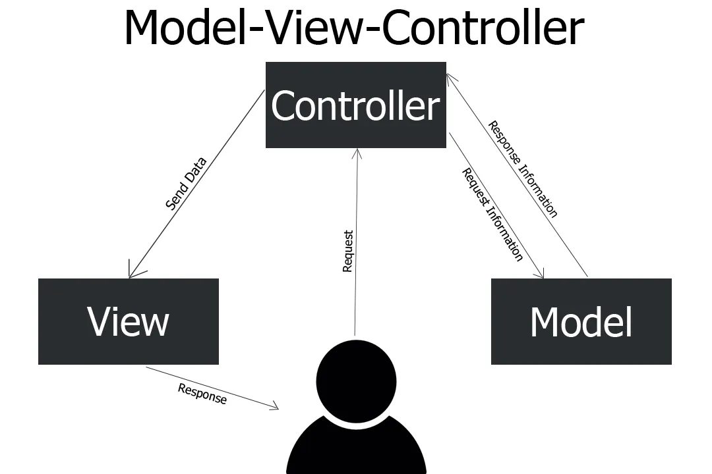

<h1> Arquitetura MVC </h1>

>

É um padrão de arquitetura de software o MVC (Model, View e Controle) é basicamente dividir a aplicação em 3 camadas.

- Model (Manipulação dos dados)
- View (A parte visual)
- Controller (Camda de controle)

<h2>Model</h2>
O model representa os dados e a logica do app. O model pode ter relação com outro models.

O model representa os dados e não faz mais nada. o model não depende do controller ou da view.Para concluir, usar o padrão MVC corretamente pode ajudar você, como desenvolvedor, a manter e atualizar seu aplicativo com facilidade

<h2>View</h2>
A view é a parte onde o usuario interage. Ele esta ligado com model, pois é onde os dados são exibidos.

<h2>Controller</h2>
O Controller está entre models e views

<h1>Projeto</h1>

- O arquivo model.py é modelagem do dados (Model).
- O arquivo dal.py é onde iremos ler e salvar os dados no banco de dados
- O arquivo controller.py é onde nos iremos verficar os dados passados e passar para o dal.py salber no banco de dados
- O arquivo view.py seria nossa interface. Nesse caso é console do terminial.
